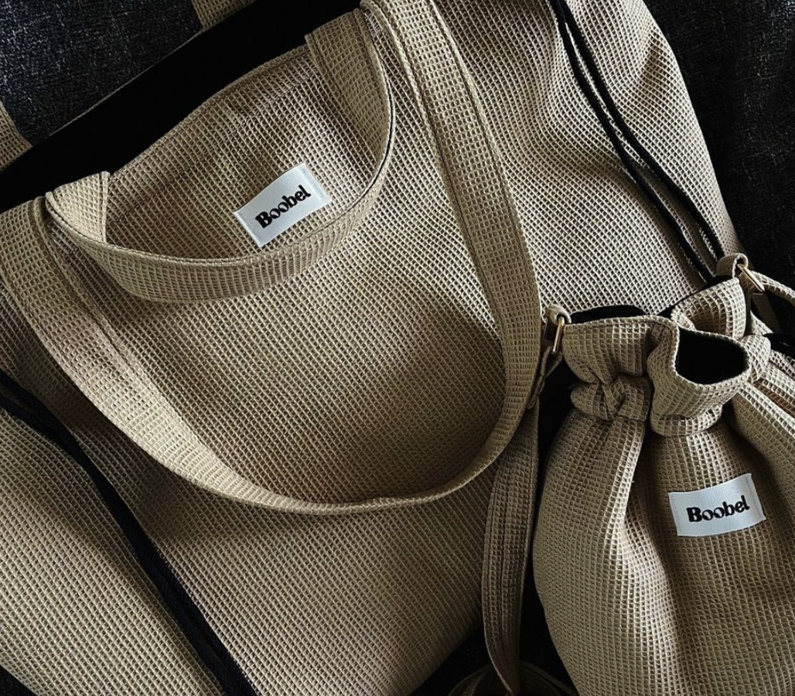

# Boobel!

## O projekcie
Boobel jest marką tworzoną przez pełną entuzjazmu młodą kobietę o imieniu Vanessa. Każda torba to unikalne rękodzieło, które łączy w sobie elegancję i funkcjonalność, zaprojektowane z myślą o osobach ceniących nie tylko styl, ale i indywidualność.

Poniżej można zobaczyć przykładowe produkcje, które oddają pasję i dbałość o szczegóły w każdym detalu. Każda torebka jest wykonana ręcznie, z najwyższej jakości materiałów, z myślą o tych, którzy kochają rzeczy piękne i niepowtarzalne.

Każdy produkt jest nie tylko praktyczny, ale również opowiada historię – od inspiracji po gotowy projekt, który możesz mieć na wyciągnięcie ręki.

## Co możesz zrobić:
- [Przeczytać więcej o założycielce](more.md)
- [Śledzić nas w mediach społecznościowych](https://www.instagram.com/boobelbyvanessa/?locale=es_ES)

## Kontakt
Skontaktuj się z nami na [boobel@example.com](mailto:boobel@example.com).

